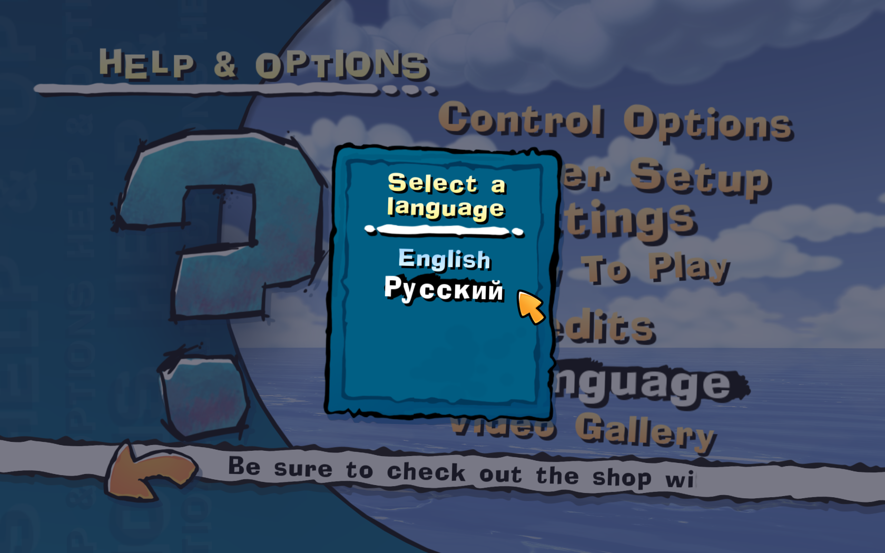
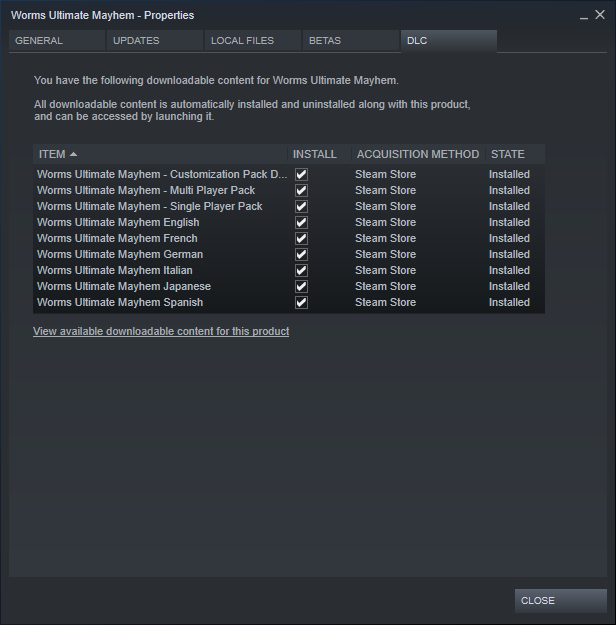

<h1>
    
    Worms Ultimate Mayhem Language Tool
</h1>

This tool allows you to modify the Steam version of Worms Ultimate Mayhem to unlock inaccessible languages, the files of which are in the game directory.

## Supported languages

- Czech
- English
- French
- German
- Italian
- Japanese
- Polish
- Russian
- Spanish

The game files also contain American and Slovak localization files. But American files are completely the same as English, and the Slovak ones are not fully translated, so I did not include them in the list.

## How to use

It's very easy! Just specify the path to your `WormsMayhem.exe` (if the application does not automatically detect it), select desired language from the list and click "Modify".

The selected language will be added to the game, with English as fallback. You may then have to manually select the language in the game.

## It doesn't work! What's wrong?

Make sure that folder `WormsXHD\Data\Language\PC\` contains the required localization `.xom` files, and that all language DLCs are activated in Steam game properties.

