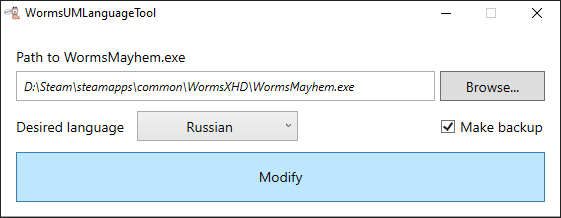

<h1>
    
    Worms Ultimate Mayhem Language Tool
</h1>

This tool allows you to modify the Steam version of Worms Ultimate Mayhem to unlock inaccessible languages, the files of which are in the game directory.

## Supported languages

- Czech
- English
- French
- German
- Italian
- Polish
- Russian
- Spanish

The game files also contain American and Slovak localization files. But American files are completely the same as English, and the Slovak ones are not fully translated, so I did not include them in the list.

## How to use

It's very easy! Just specify the path to your `WormsMayhem.exe` (if the application does not automatically detect it), select desired language from the list and click `Modify`.

If `Make backup` is checked, a folder named `LanguageToolBackups` will be created and the current `WormsMayhem.exe` will be saved inside. 

The selected language will be setted. 
If not, make sure that folder `WormsXHD\Data\Language\PC\` contains the required localization `.xom` files.

